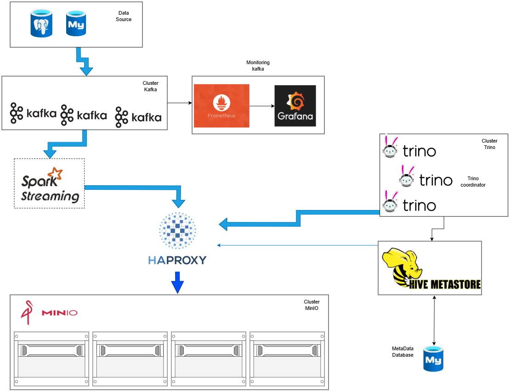

# ETL-to-object-storage-Iceberg

### Nodes and IP address:
| Node       | Service                     | IP     |
|---------------|---------------------------------|------------|
| Node1    | Kafka node1 , MinIO node1    | 192.168.16.240   |
| Node2    | Kafka node2 , MinIO node2 , Spark     | 192.168.16.241|
| Node3    | Kafka node3 , MinIO node3      | 192.168.16.242    |
| Node4    | MinIO node4      | 192.168.16.243    |
| Node5    | Hive Metastore(HMS)  , HAProxy    | 192.168.16.244    |
| Node6    | Trino Node1(Coordinator)     | 192.168.16.245    |
| Node7    | Trino Node2 ,  MYSQL       | 192.168.16.246    |
| Node8    | Trino Node3 ,  Postgres  | 192.168.16.247    |

### Stack version

  - MinIO version: RELEASE.2024-07-16T23-46-41Z
  - Kafka cluster: Kafka 3.8.1
  - MYSQL version : 8.4
  - Postgresql : 16.6
  - Trino : 455
  - Apache Hive : 3.1.3
  - Apache Spark: 3.5.1
  - Prometheus version: v3.0.0
  - Grafana version: 11.3.1
  - jmx_exporter version: 1.1.0

